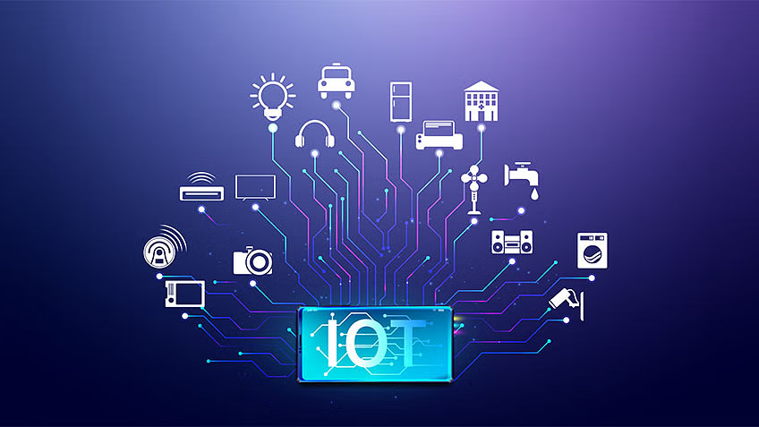

<p align='center'>
    
    </img>
</p>

<br/>

# Advanced Internet of Things Technologies

Welcome to the Advanced Internet of Things (IoT) Technologies repository! This repository is an extensive resource for students, educators, and enthusiasts interested in exploring the latest advancements in IoT. It contains a wealth of materials designed to enhance your understanding and practical skills in this rapidly evolving field.

## Contents

This repository includes:

- **Lab Assignments**: 
  - Engaging hands-on exercises that focus on advanced IoT concepts such as sensor integration, data analytics, machine learning applications, and various connectivity protocols (e.g., MQTT, CoAP).
  - Each lab assignment provides step-by-step instructions, code examples, and insights into real-world applications, allowing you to apply theoretical knowledge in practical scenarios.

- **Lecture Slides**: 
  - Comprehensive presentations covering essential topics in IoT technologies, including architecture, protocols, security, and data management.
  - Slides are designed to facilitate learning, featuring diagrams, case studies, and key takeaways that can be used for review or reference during your studies.

- **Projects**: 
  - A collection of project ideas and completed projects that showcase the application of advanced IoT technologies in real-world contexts.
  - Each project includes a detailed description, objectives, implementation steps, and any relevant code repositories. Projects range from smart home systems to industrial IoT applications, providing a diverse set of examples to inspire your own work.

## Features

- **Organized Structure**: 
  - The repository is structured for easy navigation, with materials categorized by topic and week. This organization allows you to quickly find the resources you need to support your learning.
  - Clear documentation accompanies each section, ensuring that you understand the goals and objectives of each lab, slide, and project.

- **Public Access**: 
  - All resources are freely available to encourage exploration and collaboration. Students and educators are welcome to use and share the materials for educational purposes.
  - Contributions from the community are encouraged; feel free to suggest improvements, share insights, or add your own projects.

## Getting Started

To get the most out of this repository:

1. **Explore the Labs**: Start by working through the lab assignments to gain hands-on experience with advanced IoT technologies. Each lab will help you build practical skills that are essential for success in the field.
2. **Review the Slides**: Use the lecture slides as a study aid. They are great for reinforcing concepts covered in class and for preparing for exams or presentations.
3. **Engage with Projects**: Check out the project ideas and completed projects to see how advanced IoT technologies are applied in real-world scenarios. Feel free to use these projects as inspiration for your own work or contribute your own projects to the repository.
4. **Join the Community**: Engage with fellow learners and educators by sharing your thoughts, asking questions, and contributing to discussions related to the materials.


<br/>
<br/>

## License

© [2024] [Nguyen Thanh Dang]. All rights reserved.

This repository and its contents, including but not limited to lab assignments, lecture slides, and any associated materials, are for educational purposes only. 

**No part of this repository may be copied, reproduced, or distributed without explicit permission from the copyright holder.**

For inquiries, please contact [```dangnguyen.uit@gmail.com```].